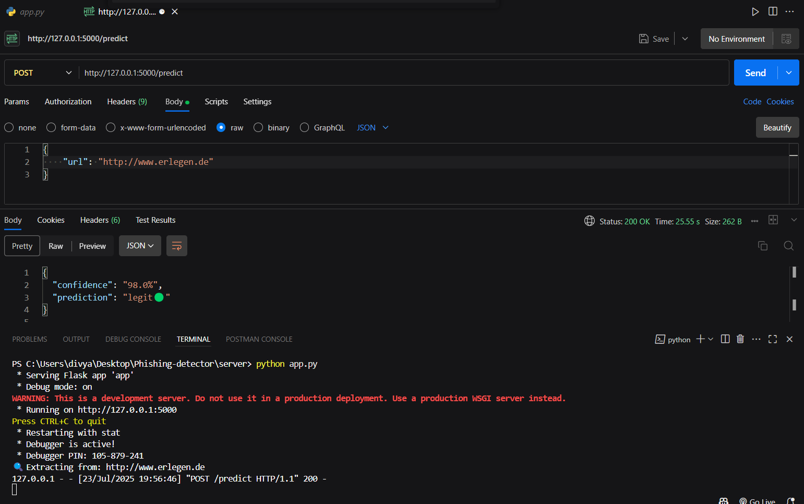
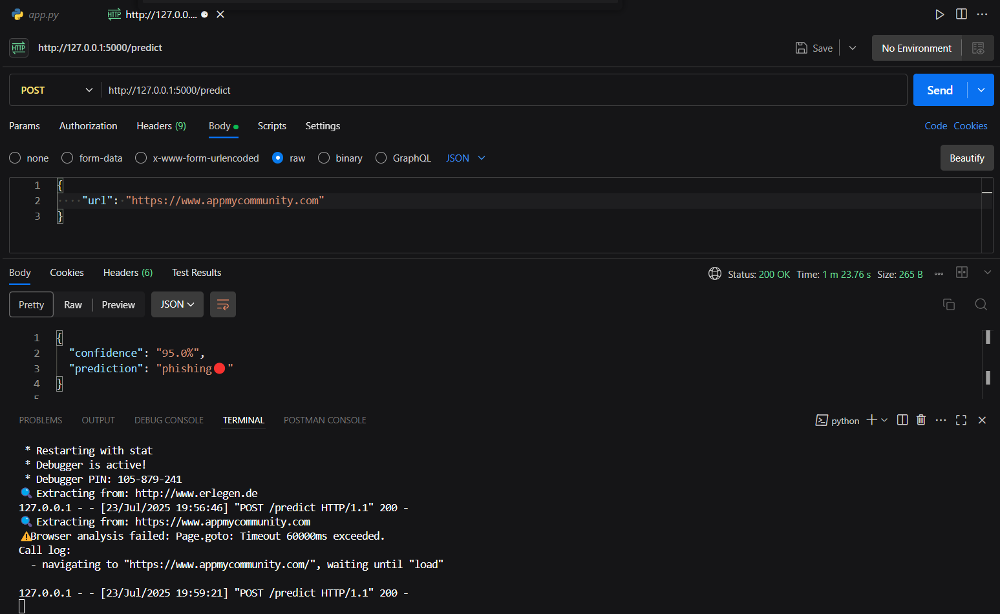
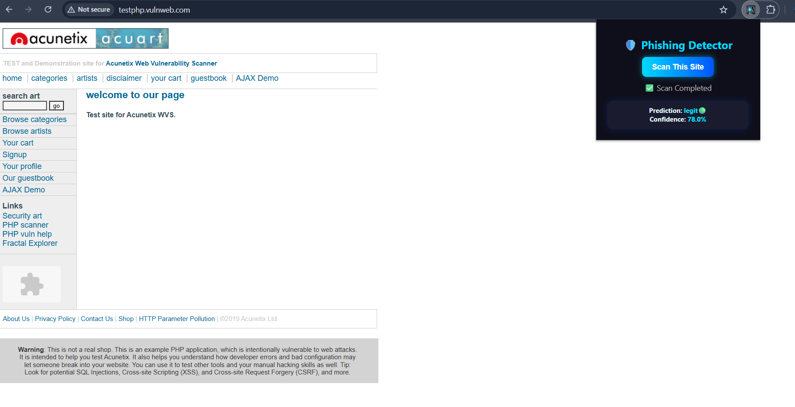

# Phishing-Detector
AI-powered real-time phishing website detector using machine learning and browser automation.

## Features
✅ Real-time URL scanning using live data  
✅ 48 intelligent features extracted per URL (DNS, SSL, WHOIS, Playwright, etc.)
✅ Detects phishing websites using Random Forest classifier
✅ Flask REST API for ML model predictions
✅ Integrated Flask backend with API for predictions  
✅ Chrome Extension to alert users during browsing  
✅ WHOIS, SSL, DNS, content, and Playwright-based behavior analysis  
✅ Custom dataset training support  
✅ Accurate, fast, and privacy-respecting
✅ Works with browser extension for instant scan

## Tech Stack

| Component          |   Tools Used                                         |
|--------------------|------------------------------------------------------|
| Language           | Python, JavaScript, HTML/CSS                         |
| Backend API        | Flask (Python)                                       |
| ML Model           | Scikit-learn (RandomForestClassifier)                |
| Extension          | Chrome Extension (Manifest V3)                       |
| Feature Extraction | Playwright, Requests, BeautifulSoup, DNS, SSL, WHOIS |
| Dataset            | Custom or open phishing datasets                     |

## How It Works

1. User visits any website
2. Extension sends the URL to Flask backend
3. Feature extractor gathers 48 real-time signals:
   - DNS, SSL, WHOIS, page content, suspicious words, etc.
4. ML model predicts `phishing` or `legit` based on those features
5. Result is shown with confidence score on extension popup

## ⚙️ Installation

Step 1: Install Backend Dependencies
Bash:
cd server
pip install -r requirements.txt
Step 2: Train the ML Model 
Step 3: Start Flask API
Base:
python app.py

Step 4: Load Chrome Extension

Open chrome://extensions/
Enable Developer Mode
Click Load unpacked
Select the extension folder

## API Endpoint (For Testing via Postman or Extension)**

 API Usage

**Endpoint:**  POST:  http://localhost:5000/predict`
**Payload Example:**
json
{
  "url": "https://suspicious-website.com"
}

Response Example:
{
  "prediction": "phishing🔴" / ("legit🟢"
  "confidence": "94.32%" / other)
}

                   
## Screenshots

### ✅ Legit Website Detection

### ❌ Phishing Website Detection

### 🌐 Extension Popup Result

## What You Learn

- How to extract phishing indicators in real time
- How to use browser automation for security tasks
- How to build your own phishing detection API
- Full ML + browser extension integration

📌Note:
1).Internet connection is required during training and scanning for real-time features (WHOIS, DNS, content).

2).This tool performs client-side prediction and does not collect any user data.

3).The prediction happens locally via your browser and local API server.

4).Your browsing history is never sent to any external server.

